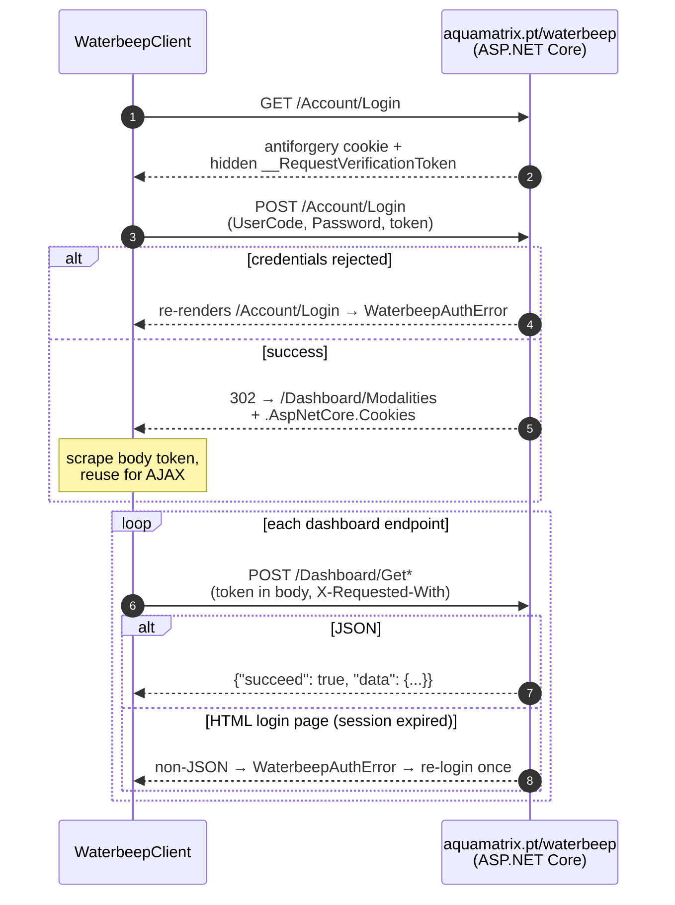
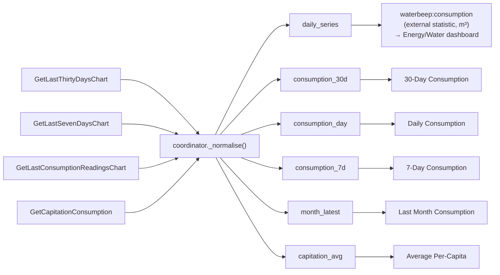
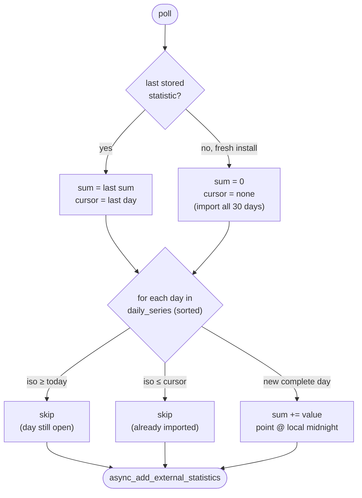

# Waterbeep API (reverse-engineered, verified live)

Waterbeep has **no public API**. This integration drives the same HTTP endpoints
the web dashboard at `https://www.aquamatrix.pt/waterbeep/` uses. The backend is
the **Aquamatrix SMSnet** platform (ASP.NET Core).

## Auth flow (verified)

1. `GET /waterbeep/Account/Login` → sets the antiforgery cookie and embeds a
   hidden `__RequestVerificationToken` in the HTML.
2. `POST /waterbeep/Account/Login` (form-encoded) with `UserCode` (the NIF),
   `Password`, `__RequestVerificationToken`. On success it **redirects to
   `/waterbeep/Dashboard/Modalities`** and sets the `.AspNetCore.Cookies`
   session cookie.
3. **The landing page embeds the token reused for AJAX calls** — scrape it from
   the login-POST response body (not from `/waterbeep/Dashboard`, which has none).
4. `POST /waterbeep/Dashboard/Get*` with the token **in the body** plus
   `X-Requested-With: XMLHttpRequest`. No header token, no cookie pairing.



## Endpoints (all POST, verified live)

| Endpoint | Body | Returns |
|----------|------|---------|
| `Dashboard/GetLastSevenDaysChart` | token | daily m³, 7 days |
| `Dashboard/GetLastThirtyDaysChart` | token | daily m³, 30 days |
| `Dashboard/GetLastConsumptionReadingsChart` | token | **monthly** m³ (billed) |
| `Dashboard/GetCapitationConsumption` | `numberOfInhabitants=N` | monthly L/person/day |
| `Dashboard/GetClientNotifications` | none | alerts (`data: null` when none) |

## Endpoint → sensor mapping



## Response shape (verified)

Daily / monthly charts:

```json
{"succeed": true, "data": {
  "labels": ["2 Jul 2026", ...],
  "years":  [2026, ...],
  "months": [7, ...],
  "days":   [2, ...],
  "values": [0.231, 0.592, 0.032, 0.005, 0.0, ...],
  "averageDailyConsumption": 0.1228
}}
```

- Daily `values` are **m³ per day**; `values` run oldest → newest.
- Monthly (`GetLastConsumptionReadingsChart`) `values` are **m³ per month** (not a
  cumulative index — confirmed: they go down as well as up).
- Capitation `values`/`averageDailyConsumption` are **litres per person per day**.
- A session that has expired serves the HTML login page instead of JSON → the
  client treats a non-JSON response as an auth error and re-logs-in once.

## Energy/Water dashboard note

None of these endpoints exposes a cumulative meter index, **and the data is
backdated** — yesterday's total is only known today. A live `total_increasing`
sensor would therefore misattribute every day's usage to the poll hour (the only
moment its value changes), scrambling the Energy dashboard's daily bars.

Instead, `statistics.py` imports each completed day as an hourly **external
statistic** (`waterbeep:consumption`) timestamped at that day's **local
midnight**, so each day lands in its own bucket and the dashboard matches the
official Waterbeep chart day-for-day. Because we re-poll a sliding 30-day window,
the running `sum` is continued from the last statistic already stored
(`get_last_statistics`) and only newer days are appended — keeping `sum`
monotonic and never re-writing history. A fresh install imports the full 30-day
history at once (no spike, since each day is its own bucket).



Because days are only ever *appended* (never rewritten) and the current day is
excluded until it closes, `sum` is strictly non-decreasing — satisfying the
statistic's `has_sum` contract.

> The captured `UserCode`/`Password`/tokens are per-session and must never be
> committed. The `UserCode` is the account holder's NIF.
