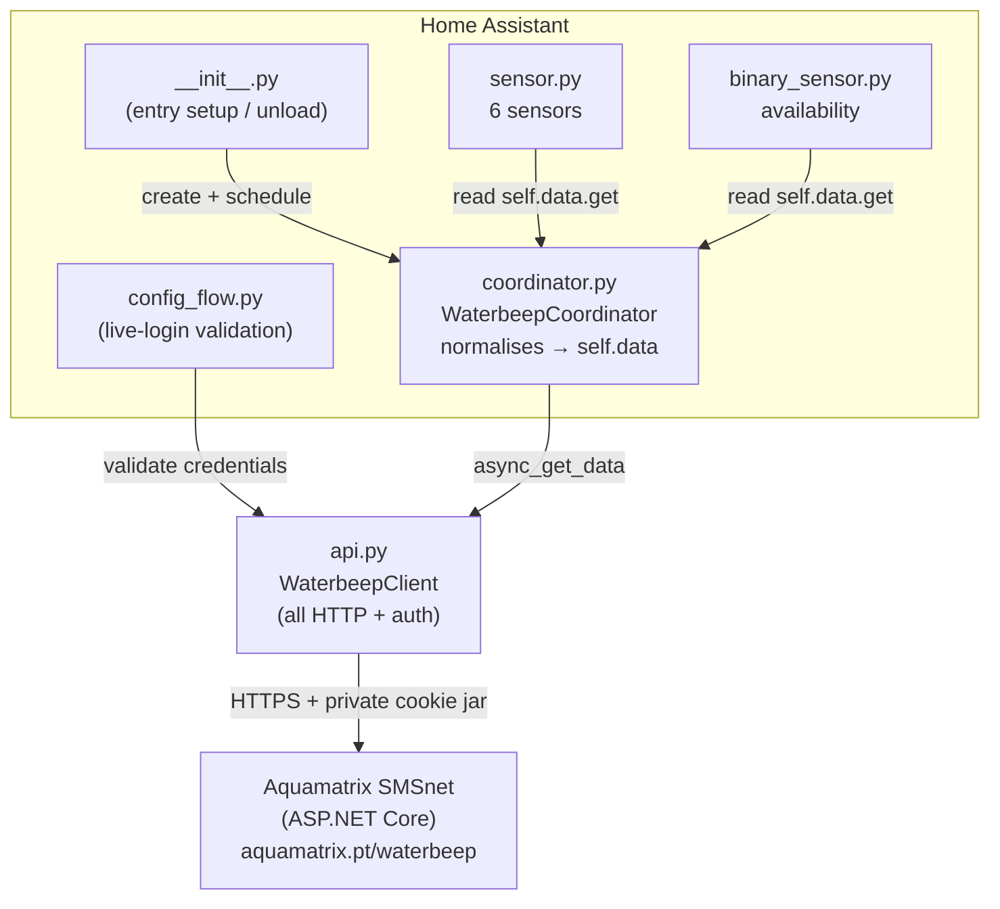
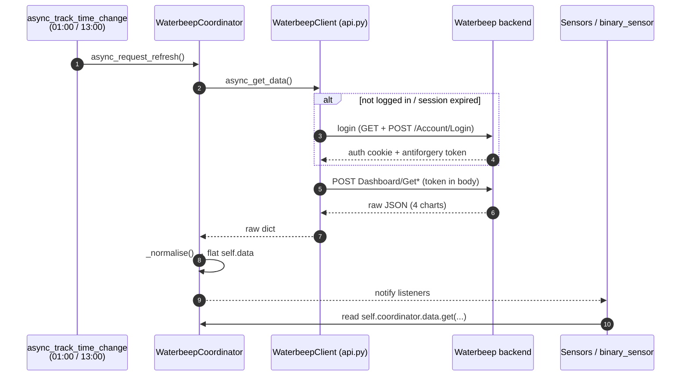
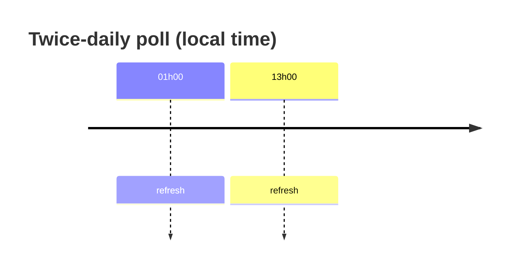

# Architecture

Waterbeep is a **cloud polling** integration. Home Assistant logs into the
Aquamatrix Waterbeep web app twice a day and reads the dashboard endpoints the
browser uses. There is no public API — HA acts as a browser client.

## Component overview

## Data flow

## Components

| File | Purpose |
|------|---------|
| `api.py` | HTTP client: private session, antiforgery handling, login, endpoint calls. **All network logic lives here.** |
| `coordinator.py` | `DataUpdateCoordinator`; normalises the four raw payloads into a flat `self.data`, then hands the daily series to `statistics.py`. |
| `statistics.py` | Imports each completed day as a long-term **external statistic** (`waterbeep:consumption`) — the Energy/Water dashboard source. |
| `const.py` | `Final`-typed constants: config keys, endpoints, entity suffixes, `coordinator.data` keys, `POLL_HOURS`. |
| `config_flow.py` / `__init__.py` | Setup UI (validated by a live login) / entry point (registers the twice-daily schedule). |
| `sensor.py` / `binary_sensor.py` | Entities. All state read from `coordinator.data`; return `None` when missing. |

## Sensors

| Entity | `coordinator.data` key | Unit | State class |
|--------|------------------------|------|-------------|
| Daily Consumption | `consumption_day` | m³ | `measurement` |
| 7-Day Consumption | `consumption_7d` | m³ | `measurement` |
| 30-Day Consumption | `consumption_30d` | m³ | `measurement` |
| Last Month Consumption | `month_latest` | m³ | `measurement` |
| Average Per-Capita Consumption | `capitation_avg` | L | `measurement` |
| Available (binary) | `available` | — | — |

The sensors above are **informative** (all `measurement`). The Energy/Water
dashboard is instead fed by the `waterbeep:consumption` **external statistic**
imported from `daily_series` (see [`API.md`](API.md) and `statistics.py`).

### Why a statistic, not a `total_increasing` sensor

Waterbeep data is **backdated** — yesterday's total is only known today. A live
`total_increasing` sensor can only report that the running total went up *now*,
so the Energy dashboard (which derives consumption from the sensor's hourly
deltas) attributes every day's usage to the poll hour and scrambles the daily
distribution. Importing each completed day as an hourly statistic timestamped at
that day's **local midnight** places each day's m³ in its own bucket, so the
dashboard matches the official Waterbeep chart day-for-day, history included.

## Polling schedule

`update_interval` is `None` — there is no tight periodic loop. Instead the
coordinator registers two fixed daily refreshes via `async_track_time_change`
at the hours in `POLL_HOURS` (`01:00` / `13:00`) to stay low-profile against
Waterbeep's servers. Readings arrive daily for the previous day, so more
frequent polling would add no value.

## Rules

1. **All network logic in `api.py`.** The coordinator never talks HTTP directly.
2. **All state in the coordinator.** Entities only read `self.coordinator.data.get(...)`.
3. **The client owns its own cookie jar** — never the shared HA session — so the
   authenticated session is isolated.
4. **Poll twice a day** (`01:00` / `13:00`) via `async_track_time_change`.
5. **Log via `_LOGGER`**, never `print()`.
6. Re-login transparently once on an auth error, then fail the update.
